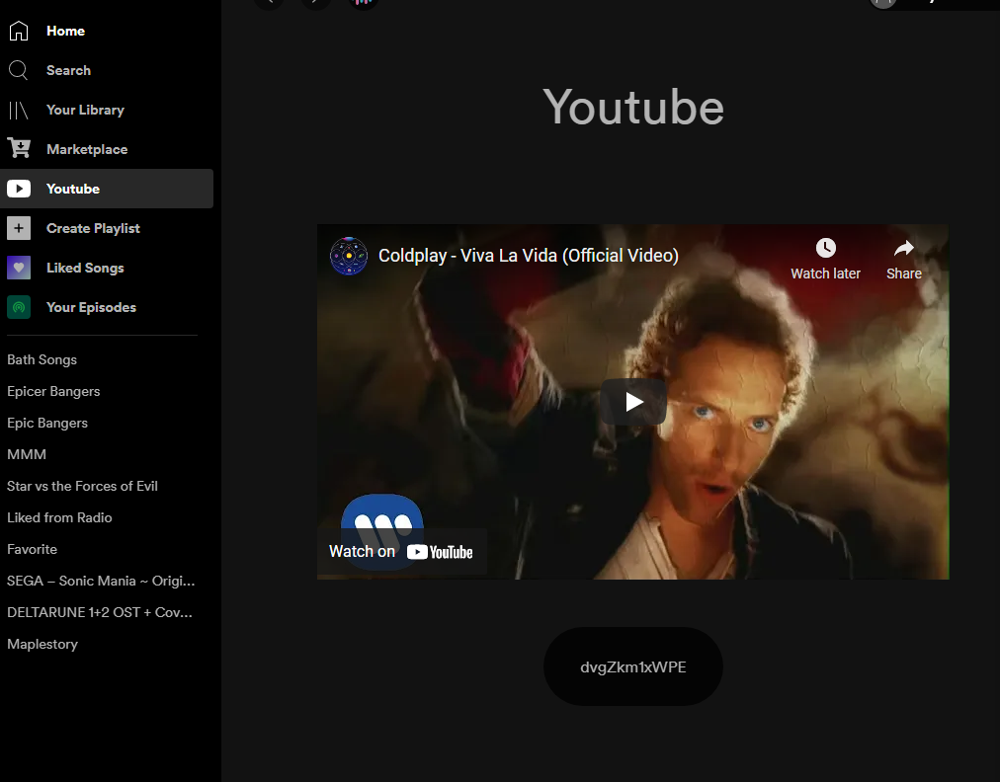

# spicetify-watch-yt
An example custom app made with [Spicetify Creator](https://github.com/FlafyDev/spicetify-creator)

## Installation
1. Copy the files from this repo's `~/dist` folder to `.spicetify\CustomApps\spicetify-watch-yt`
2. Enter this
```
spicetify config custom_apps spicetify-watch-yt
spicetify apply
```

## Preview

